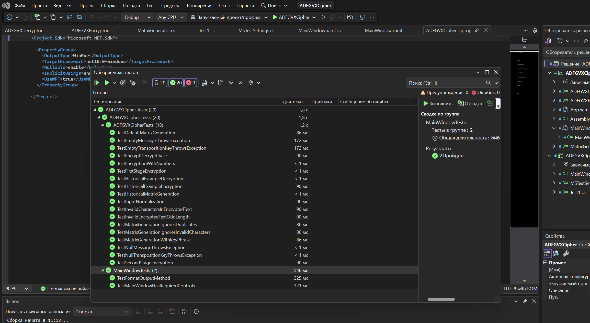

# Практическая работа 7, часть 2 - Оп. Н.

## Цель работы
Произвести процедуру отладки программного обеспечения встроенными средствами среды программирования Microsoft Visual Studio.

## Диаграмма вариантов использования
Актор: Пользователь

Варианты использования:
1. Зашифровать сообщение
   - Ввести исходное сообщение
   - Ввести ключевую фразу для матрицы (опционально)
   - Ввести ключ перестановки
   - Получить зашифрованный текст

2. Дешифровать сообщение
   - Ввести зашифрованное сообщение
   - Ввести ключевую фразу для матрицы (опционально)
   - Ввести ключ перестановки
   - Получить расшифрованный текст

3. Просмотреть текущую матрицу

## Ход работы
Вариант 6.

В ходе работы были разработаны тесты в следствии следования парадигме разработки T-D-D. Для отладки применялись, собственно, тесты, отладчик Visual Studio.

В качестве доказательства работоспособности тестов привожу скриншот окна обозревателя тестов ниже.

## Скриншоты

## Ручное нефункциональное тестирование
В ходе него стало понятно, что, несмотря на то, что нигде, где описывается шифр ADFGVX, не пишется, что стоит избегать несочетающихся нацело текстов+ключей перестановки, но какая разница. Проблему с ними я устранил через костыль, при котором при наличии такой ситуации в текст добавляется заполнитель, указвающий на пустые поля.

## Вывод
В рамках данной работы были повторены все пункты практического "ликбеза", выполнено практическое задание на основе опыта "ликбеза", все тесты завершаются успешно.
